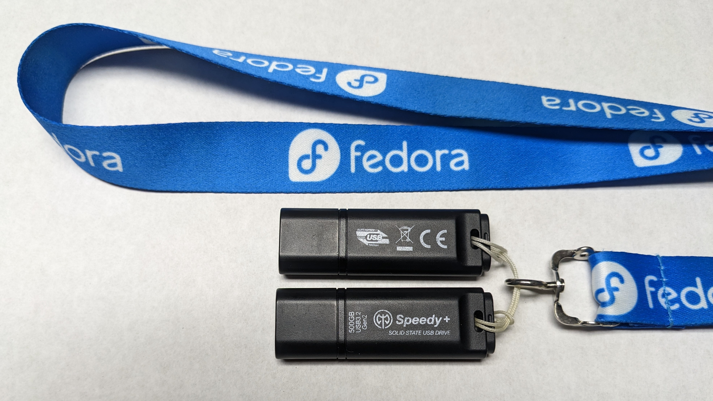

# homelock

Mount (on login) and unmount (on logout) an encrypted home directory backed by a ZFS filesystem.

# Requirements

- ZFS
- Fedora Linux

# Dependencies

- pam
- bash
- coreutils
- util-linux (mountpoint, findmnt, setterm)
- selinux-policy-devel (needed by 'sepolicy\_install')
- lsof (needed if forced-unmounting is enabled)

# Installation

From the root of this git repostory, run the following commands to install homelock on a Fedora Linux system:

    $ sudo make install
    $ sudo make sepolicy_install

After it is installed, you will need to edit /etc/security/homelock.conf and change the *poolname* and *username* values to match your environment. You might also need to adjust the value for the HOMES variable so that it will resolve to the correct path for your encrypted user home directories.

To uninstall homelock, the following commands can be used:

    $ sudo make uninstall
    $ sudo make sepolicy_uninstall

# PAM

There is a helper script named pam-config that is called automatically by `make install/uninstall`. The pam-config script is a wrapper around the `authselect` system configuration tool. It amends (or unamends) the currently selected authselect profile. If you change your authselect profile after installing homelock, you will need to rerun `sudo ./pam-config add` to re-amend the selected profile.

# How it works

This software is a single script -- `homelock` -- that is called from the PAM authentication subsystem to unlock and mount a home directory on user login and subsequently lock and unmount a home directory on user logout. It will use the password provided during user login to unlock the home directory.
 
At its core, this script is executing two commands: `zfs mount -l $HOMES` on user login and `zfs unmount -u $HOMES` on user logout ($HOMES is set in homelock.conf). If provided a password on standard input, the `-l` option to `zfs mount` will automatically unlock an encrypted filesystem. By calling `homelock` using `pam_exec.so` from PAM's *auth* stack with the *expose_authtok* option set, the homelock script (and, by extension, the `zfs mount -l $HOMES` command) is provided the user's login password on standard input.

This script is designed to work with console logins (though it may be possible to make it work with other PAM services such as GDM). In particular, it prints success or failure status messages to /dev/console so the user will know that their directory has been locked after they exit their login session. This system works well with the Sway window manager which can be launched directly from the console after the user has logged in (see Appendix A below for an example ~/.bashrc snippet that I use to auto-launch Sway when I sign in on TTY1).

# Known Bugs

If exporting the pool on logout is enabled, logging out and back in quickly may fail while trying to re-import the pool. The login will timeout after 60 seconds and logging in will succeed on the next try.

# Disclaimer

This program is distributed in the hope that it will be useful, but WITHOUT ANY WARRANTY; without even the implied warranty of MERCHANTABILITY or FITNESS FOR A PARTICULAR PURPOSE. See the GNU Lesser General Public License for more details.

# Appendix A

The following script, if saved as ~/.bashrc.d/99-sway-on-tty1, will launch the Sway window manager when you sign in on TTY1.

    # Run Sway on TTY1
    if [[ -x /usr/bin/sway ]] && [[ $(tty) == /dev/tty1 ]]; then
        SSH_AGENT=()
        if [[ -x /usr/bin/ssh-agent ]] && [[ -e $XDG_RUNTIME_DIR ]]; then
           SSH_AGENT=(
              /usr/bin/ssh-agent -a "$XDG_RUNTIME_DIR/ssh.socket"
           ) 
        fi

        printf 'launching sway ...\n'
        exec 0<&- &> /dev/null
        exec "${SSH_AGENT[@]}" /usr/bin/sway
    fi

# Appendix B

As an optional feature, this homelock script will accept a `-e` flag when called from the session stack in /etc/pam.d/homelock which will instruct it to import the ZFS pool containing the user's home directory when they sign in and export it when they sign out. The `-e` feature flag is useful in case the user has moved their home directory to a ZFS pool on a removable device such as a USB drive.

**TIP**: If you choose to store your home directory on a USB flash drive, be aware that the typical USB flash drive does not perform well when doing random I/O. You may need to purchase a flash drive that boasts good, sustained random I/O throughput. For what it is worth, I own a couple Axe Memory SuperSpeed+ USB 3.2 Gen2 flash drives that work very well as removable drives to keep my mirrored and encrypted ZFS home directory on:

